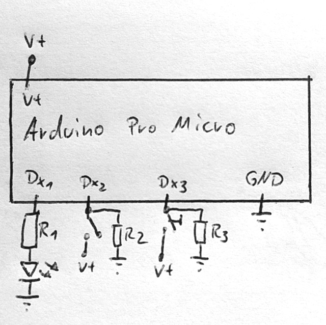

# :red_circle: onair

Send a hotkey of your choice to control for example Push-to-Talk. Either as long as the button is pressed or as long as the switch is enabled.

## Part list

#|Part|Count|Identifier|Description
-|----|-----|----------|-----------
1|Arduino Pro Micro|1|-|Microcontroller 
2|Micro-USB Cable|1|-|Connection to an arbitrary PC
3|220Ω Resistor|1|R1| Limits the current of the LED
4|1kΩ Resistor|2|R2, R3| pull-down resistors for the switch and button to avoid glitches
5|Red LED|1|-|Indicator that the hotkey is currently pressed
6|Switch|1|-|Switch to hold a hotkey
7|Pushbutton|1|-|Button to do traditional _push to talk_

The Arduino must support the keyboard library (`keyboard.h`). The Arduino Nano for example does not.

## Circuit

